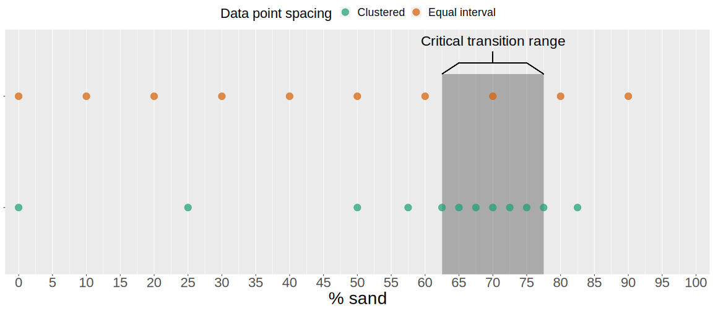

```{r setup, include=FALSE}
options(htmltools.dir.version = FALSE)
library(kableExtra)
knitr::opts_chunk$set(echo = F)
```
class:inverse

# Topics

.extrabigger[
- Experiment priorities


- Statistics / design


- IP / licensing ]

---

class: inverse

# Ultimate goals
.bigger[
- Predict performance of any mix....**even those we haven't tested**

- **"Recreational" mixes:**
  - upper boundary of % sand governed by ability to _ever_ achieve "cleat-in, cleat-out" effect...._c.f. nonplastic_

- **"Pro" mixes:**
  - lower boundary of % sand governed by ability to work/groom the soil....can't make it too "clayey" (i.e. strong) when dry.

- Once possible mixes known....what are their acceptable &Delta;H<sub>2</sub>O?]
    
    
???

    - In other words, we can tell you what your target mixes should be based on maintenance level and also once you've made them we know how they will perform compared to other sorts of mixes. 


---

class: inverse
# Questions to answer 
.bigger[
- How does "clay type" affect performance?
  - related: do different clays need the same sand % ?


- Is SCR the right predictor of actual performance?


- How does the nature of the sand affect behavior of the mix?


- Can the mix properties be fine-tuned by using 3 components instead of 2?

]

---
class: inverse
# 4 experiments to answer those questions:

.bigger[
- How does "clay type" interact with added sand?
  
  -  "Clay type" x varying sand %


- Is SCR the right predictor of actual performance?
  
  - Silt **:** clay ratio @ same sand content & type
  
- How does the nature of the sand affect the bulk mix performance?

  - Sand properties experiment
  
- Can the mix properties be fine-tuned by using 3 components instead of 2?

  - Clay mixtures (the "secret sauce")
  ]

---
class: inverse
# Experiment 1 - Foundation 

.extrabigger[Question: What's the interaction between clay toughness/clay minerals and sand % ?]

.bigger[Hypotheses: 

- Tougher clays need more sand to "dillute" them
- the ratios needed to make a mix with "recreational properties" vs. "professional properties" will not always be 70 % and 60 % sand...sometimes more, sometimes less]

.bigger[- Different kinds of clay mixed with the same sand but in different sand %.

- These are the two most important things so I want to test it first. 
]

---
class: inverse
# Experiment 1 - Anticipate thresholds 

```{r echo=F, message=F, warning=F}
library(tidyverse)

sand_pcts <- tibble(method= c(rep("Equal interval", 10), rep("Clustered", 12) ),
       sand_pct= c(seq(0, 90, 10),
  c(0, 25,50,57.5,62.5,65,67.5,70,72.5,75, 77.5, 82.5))
)

sand_pcts_to_choose <- sand_pcts %>% 
    ggplot(aes(sand_pct, method, color=method))+
    geom_rect(xmin=62.5, xmax= 77.5, ymin=-Inf, ymax=2.2,
            alpha=1/50,
            color=NA)+geom_point(alpha=0.7, size= 5)+
  scale_x_continuous("% sand",
                     breaks = scales::breaks_width(width = 5, offset = 0),
                     limits = c(0, 100),
                     expand=expansion(mult=c(0,0), add = c(2,2)))+
  annotate("text",
           label= "Critical transition range",
           size=8,
           x= 70,
           y=2.5)+
    geom_segment(color= "black", x=65, xend= 75,
               y=2.3, yend=2.3)+
  geom_segment(color= "black", x=62.5, xend=65, y=2.2, yend=2.3)+
  geom_segment(color= "black", x=77.5, xend=75, y=2.2, yend=2.3)+
  geom_segment(color= "black", x=70, xend=70, y=2.3, yend=2.4)+
  scale_color_brewer(name= "Data point spacing",
                     palette = "Dark2")+
  theme(
    axis.text.y = element_blank(),
    axis.title.y = element_blank(),
    panel.grid.major.y =element_blank(),
    text = element_text(size=22),
    axis.text.x = element_text(size=22),
    axis.title.x = element_text(size=28),
    legend.position = "top"
  )
ggsave(plot= sand_pcts_to_choose, filename = 'choosing_sand_pcts_to_test.svg', height = 7, width = 16)

```

???

Need to cluster the data points around the transitional fines content. Most of the change happens around this point, but the number is different for every combination of sand-clay. More uniform sands will need more clay+water to fill their pores completely, and tougher clays will need more sand to render them non-plastic. 

---
class: inverse
# Experiment 1 - Choose clays wisely
.bigger[
- Span toughness spectrum so to allow predictions about soils we did not test 

- Pick 4 clays w/ varying toughness:
 1. Ultisol (kaolin/sesquioxides)
 2. Shale/common brick clay (illite-smectite)
 3. Pure, fine-grained kaolin
 4. Ca-bentonite
 
- Maximum toughness of these _roughly_ correspond to 10, 20, 30, 50 kJ/m<sup>-3</sup> 
  - gives **&approx;** equal spacing from lowest to highest encountered toughness 
   
- **1** sand type  x  **12** sand percents  x  **4** "base" clays  = **48 mixes; ~12 weeks**
]

---
class: inverse
# Experiment 2 - Silt-to-clay Ratio vs clay minerals

.extrabigger[Question: Is SCR the right thing to measure?]

.bigger[

**SCR concept assertion:** 
"Adding silt-size particles to a soil with low SCR (<0.5) will improve its performance."

**Hypothesis:**  
Adding silt will make this soil _worse_. It's not only the clay-size particles that matter. Low-activity clay is no good to work with.

- What predicts performance? SCR | XRD | Atterberg lims | **toughness test**

- **1** sand percent  x  **4** "base" clays  x  **5** SCR = **20 mixes; ~5 weeks**

]

---
class: inverse 
# Experiment 2 - Silt-to-clay Ratio vs clay minerals

```{r echo=F}
scrs <- tibble(clay_pct= seq(0.1, 1, 0.1),
               silt_pct= 1- clay_pct,
               scr= silt_pct/clay_pct)
scrs_plot <- scrs %>% 
  ggplot(aes(clay_pct, scr))+
  geom_point()+
  labs(x= bquote("% < 2"~mu~"m"),
       y="Silt-to-clay ratio",
       title = bquote("Silt-to-clay ratio is deceiving because it is nonlinear with"~Delta~"% clay")
       )+
  theme(
    axis.title.y = element_text(angle=0, vjust = 0.5)
  )
scrs_plot
```


- Won't find 2 soils with identical SCR.....have to make it yourself

- Add 325 mesh ground silica to the 4 clays from Expt. 1 to make 20 new "clays"...with SCR of SCR<sub>min</sub>, 0.5, 1, 3, 6


---
class: inverse 

# Experiment 3 - Sand properties

.extrabigger[Question: how do sand size and uniformity affect mix performance?]

Hypotheses:

- effect sizes: size > uniformity > shape

- best-performing will be very coarse, very uniform, round
  - allows clay to perform "unimpeded"
  - doubtful whether angularity is important...instead of including here, do a side-study with Atterberg limits. Add later if time permits.

- Pick 3 sands w/ similar uniformity:
 1. "fine" (D<sub>50</sub>&approx;250 &mu;)
 2. "medium" (D<sub>50</sub>&approx;500 &mu;)
 3. "coarse" (D<sub>50</sub>&approx;1000 &mu;)
 
- Plus 1 sands with similar D<sub>50</sub> to sand (2) above, but different C<sub>u</sub>
 
- only 1 clay to start...isolate effect of sand w/o testing interaction 

- **1** clay  x  **4** sands  x  **5** sand percents = **20 mixes; &approx;5 weeks**
 
---

class: inverse 

# Experiment 4 - Model validataion and artificial clay mixtures

.bigger[Question: What can be done if only poor-performing clay is available locally?]

Hypotheses:

- poor-performing clay can be "rescued" via small additions of another clay

- Mix performance can be predicted from clay toughness and sand properties

Methodology: 
- choose worst-performing clay from Experiment 1
  - beneficiate with small amounts of Na-bentonite, THEN mix with sand

- 5 sand contents, 1 sand types

- **1** clays  x  **5** bentonite ratios  x  **5** sand percents = **25 mixes; ~ 7 weeks**
 
---

class: inverse
# Stats - philosophy vs. real life

.bigger[
- Can't test everything x everything 

- Predict, not evaluate

- ANCOVA, not ANOVA; slopes & intercepts, not multiple comparisons

<brk/>

.center[**The ultimate model:**]]
.bigger[
$$Mix~performance~=\\~clay~toughness~+~sand~\%~+~sand~size~+sand~uniformity$$ ]

???

    - in a perfect world we would test every kind of clay with every kind of sand in every ratio and at every water content

    - need to split these up into separate experiments

    - the primary interest is not pointing out what "treatment" is the best. It is knowing quantitatively what the response variable is based on model inputs (clay toughness, sand %, sand uniformity, sand size). 

    - it is regression, not ANOVA.... but have to account for possible nuisance variables, so it becomes ANCOVA

    - the philosophical problem I am up against is re-using the cylinders because they are technically not separate experimental units. 

---

class: inverse
# Nuisance variables 
.bigger[
- the two nuisance variables are replicate (cylinder) and day. These should both be treated as random effects, while water content should be treated as a fixed effect. 

- Kind of the opposite of what's normally done in a field trial; water content might be run as a covariate because it is a nuisance variable to your treatments; in this case the treatments are the nuisance variables. 

- split-plot in time? 
]

---

# Experimental design
```{r}
expt_design <- tribble(
  ~"Variable", ~"Class", ~"N", ~"Degrees of Freedom",
  "Sand %", "fixed", 12, 1,
  "Clay toughness",  "fixed", 4, 3,
  "Water content",  "fixed", 3, 1,
  "Block", "random", 3, 2, 
  "Day",   "random", 3, 2,
  "Residual error", NA, NA,  12*4*3*3 - 9,  
  "Total", " - ", (12*4*3*3), (12*4*3*3 -1)  )

expt_design %>% 
  kableExtra::kbl(caption = "Error terms for fixed and random effects." ,
                   align = 'llcc') %>% 
  kableExtra::row_spec(row = 7, bold = T) %>% 
  kableExtra::kable_styling()
```

---

# Time frame 


```{r}
expt_info <- tibble(
  experiment = as.character(1:4),
  description = c(
    "Clay type x sand %",
    "Same SCR for different clay minerals",
    "Sand properties x sand %",
    "Inventing new 3-way mixtures"
  ),
  n_mixes = c(4*12, 4*5, 4*5, 1*5*5),
  n_cylinders= n_mixes*3,
  est_weeks = n_mixes/4
  )

total_mixes <- sum(expt_info$n_mixes)
total_cyls <- sum(expt_info$n_cylinders)
total_weeks <- sum(expt_info$est_weeks)

expt_summary <- expt_info %>% 
  add_row(experiment= "Total",
          description= ' - ',
          n_mixes = total_mixes,
          n_cylinders = total_cyls,
          est_weeks = total_weeks)

expt_timeframe <- expt_summary %>%  
  kableExtra::kbl(align = 'clccc',,
                  digits = 0,
    col.names = c("Experiment", 
                  "Description", 
                  "# of mixes", 
                  "# of samples", 
                  "Estimated time (wk)")) %>% 
  row_spec(row = 4, hline_after = T ) %>% 
  row_spec(row = 5, bold=T ) %>% 
  kable_styling()
expt_timeframe

```

